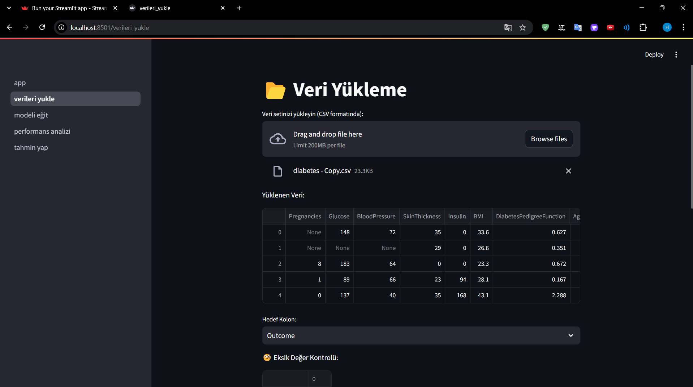
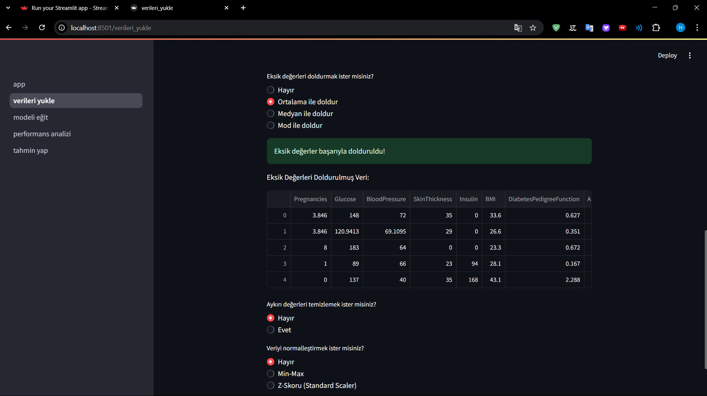
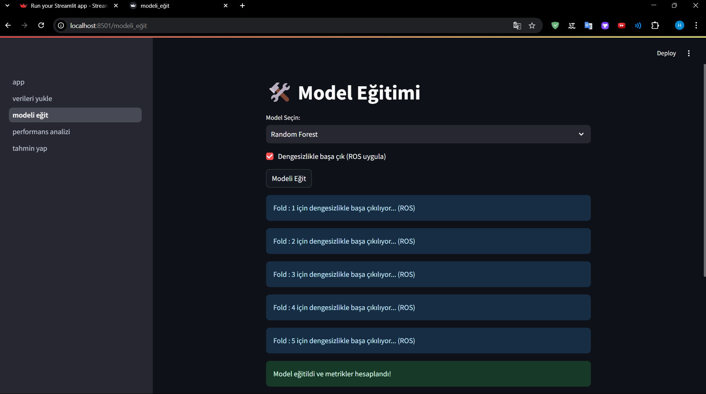
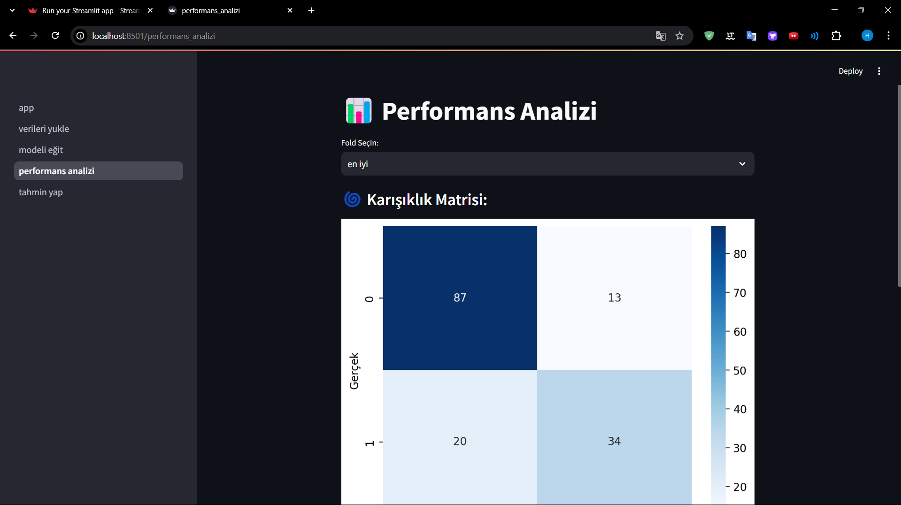
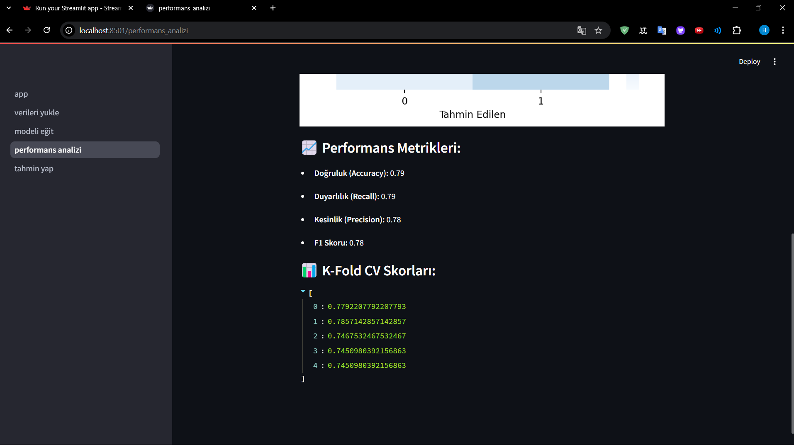
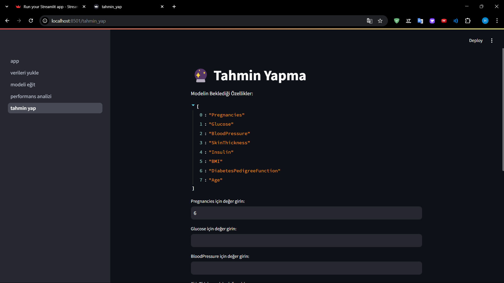

# 🛠️ AI-Model-Builder

Bu proje, makine öğrenimi modellerini kolayca eğitmek, değerlendirmek ve veri ön işleme işlemlerini gerçekleştirmek için geliştirilmiş bir **Streamlit uygulamasıdır**. Kullanıcı dostu bir arayüz sunarak verilerinizi yükleyebilir, eksik değerleri doldurabilir, aykırı değerleri temizleyebilir, veriyi ölçeklendirebilir ve çeşitli modelleri eğitebilirsiniz.

---

## 🚀 Özellikler

- 💾 **CSV formatında veri yükleme**
- 🔍 **Eksik değer tespiti ve doldurma (Ortalama, Medyan, Mod)**
- ⚠️ **Aykırı değer tespiti ve temizleme (Z-Skoru Yöntemi)**
- 🔄 **Veri normalizasyonu (Min-Max, Z-Skoru)**
- 🏆 **Random Forest, Lojistik Regresyon ve SVM ile model eğitme**
- 📊 **5 katlı çapraz doğrulama (Stratified K-Fold)**
- 🎯 **Dengesiz veri setleri için Random Oversampling (ROS)**
- 📊 **Karışıklık matrisi ve performans metrikleri görüntüleme**
- 🔮 **Eğitilen model ile tahmin yapma**

---


## 🖼️ Ekran Görüntülerı

📌 **Veri Yükleme & Ön İşleme**  



📌 **Model Eğitme**    


📌 **Performans Analizi**  


📌 **Performans Analizi**  


📌 **Tahmin Yap**  



---


## 🏰️ Kurulum ve Çalıştırma

Bu projeyi çalıştırmak için aşağıdaki adımları izleyin:

### **1️⃣ Gerekli Kütüphaneleri Yükleyin**
Öncelikle Python ortamınızı oluşturun ve aşağıdaki komutu çalıştırarak bağımlılıkları yükleyin:

```bash
pip install -r requirements.txt
```

**Gerekli Başlıca Kütüphaneler:**
- `streamlit`
- `pandas`
- `numpy`
- `scikit-learn`
- `seaborn`
- `matplotlib`
- `imbalanced-learn`

---

### **2️⃣ Uygulamayı Başlatın**

Aşağıdaki komutu terminalde çalıştırarak uygulamayı başlatabilirsiniz:

```bash
streamlit run app.py
```

Ardından, tarayıcınızda **http://localhost:8501** adresinden erişebilirsiniz.

---

**📩 İletişim**

Eğer herhangi bir sorunuz veya geri bildiriminiz varsa, benimle iletişime geçmekten çekinmeyin!
